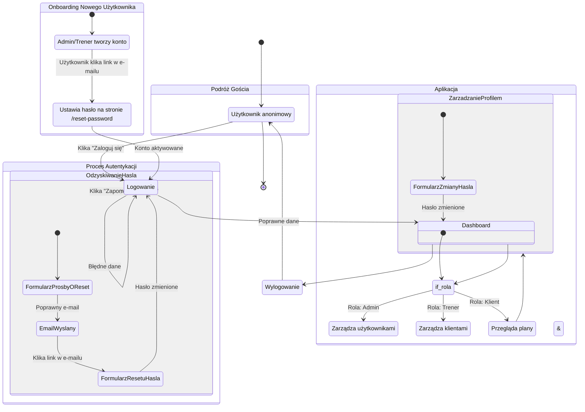

<user_journey_analysis>

### 1. Ścieżki użytkownika

- **Gość (Niezalogowany)**:Nie moze przeglądać nic poza login page.
- **Onboarding Użytkownika (Nowy Użytkownik)**: Podróż rozpoczyna się od otrzymania e-maila z zaproszeniem od administratora lub trenera. Użytkownik klika w link, ustawia hasło i aktywuje swoje konto.
- **Logowanie**: Standardowy proces logowania dla aktywowanych użytkowników.
- **Odzyskiwanie Dostępu**: Użytkownik, który zapomniał hasła, może je zresetować.
- **Korzystanie z Aplikacji (Zalogowany)**: Użytkownik (admin, trener, klient) wykonuje zadania zgodne ze swoją rolą.
- **Zarządzanie Kontem**: Zalogowany użytkownik może zmienić swoje hasło.

### 2. Główne podróże i stany

- **Start**: Użytkownik ląduje na stronie głównej lub otrzymuje e-mail z zaproszeniem.
- **Stan Niezalogowany**: Użytkownik może jedynie próbować się zalogować lub zresetować hasło. Nie ma możliwości samodzielnej rejestracji.
- **Proces Aktywacji**: Stan, w którym nowy użytkownik ustawia swoje hasło po raz pierwszy.
- **Stan Zalogowany**: Użytkownik ma dostęp do funkcji aplikacji zgodnie ze swoją rolą.

### 3. Punkty decyzyjne

- **Otrzymanie e-maila z zaproszeniem**: Czy użytkownik aktywuje konto? -> Proces aktywacji / Brak akcji.
- **Na stronie logowania**: Czy użytkownik pamięta hasło? -> Logowanie / Odzyskiwanie hasła.
- **W panelu**: Jaką rolę ma użytkownik? -> Widok Admina / Widok Trenera / Widok Klienta.

</user_journey_analysis>

<mermaid_diagram>

</mermaid_diagram>
