<architecture_analysis>

### 1. Lista komponentów

**Strony (Astro):**

- `/` (Strona główna)
- `/login` (Strona logowania)
- `/forgot-password` (Strona odzyskiwania hasła)
- `/reset-password` (Ustawianie hasła po zaproszeniu/resecie)
- `/admin/users` (Lista użytkowników)
- `/admin/users/new` (Formularz tworzenia użytkownika przez admina)
- `/trainer/clients` (Lista klientów trenera)
- `/trainer/clients/new` (Formularz tworzenia klienta przez trenera)
- `/profile` (Wspólna strona profilu)

**Komponenty (React):**

- `LoginForm.tsx`
- `ForgotPasswordForm.tsx`
- `ResetPasswordForm.tsx`
- `ChangePasswordForm.tsx`
- `CreateUserForm.tsx` (Używany przez admina, pozwala wybrać rolę)
- `CreateClientPage.tsx` (Komponent-strona dla trenera, renderuje formularz dodawania klienta)
- `Header.tsx`
- `ProfileContainer.tsx`

**API Endpoints (Astro):**

- `/api/auth/login`
- `/api/auth/logout`
- `/api/users` (POST, używany do tworzenia użytkowników)
- `/api/auth/change-password`
- `/api/auth/reset-password/request`
- `/api/auth/reset-password/confirm`

### 2. Główne strony i ich komponenty

- **Strona `/admin/users/new`**: Zawiera `CreateUserForm.tsx`, gdzie administrator może utworzyć każdego rodzaju użytkownika.
- **Strona `/trainer/clients/new`**: Zawiera `CreateClientPage.tsx`, gdzie trener tworzy nowego klienta (z ograniczonymi opcjami).

### 3. Przepływ tworzenia użytkownika

- **Administrator**:
  1. Przechodzi do `/admin/users/new`.
  2. Wypełnia `CreateUserForm`, wybierając rolę (admin, trener, klient).
  3. Formularz wysyła żądanie do `POST /api/users`.
  4. System tworzy użytkownika i wysyła e-mail z linkiem aktywacyjnym do `/reset-password`.
- **Trener**:
  1. Przechodzi do `/trainer/clients/new`.
  2. Wypełnia formularz w ramach `CreateClientPage`.
  3. Formularz wysyła żądanie do `POST /api/users` (z domyślną rolą `client` i ID trenera).
  4. System tworzy klienta i wysyła e-mail aktywacyjny.

```mermaid
flowchart TD
    subgraph "Warstwa Prezentacji (UI)"
        direction LR
        subgraph "Strony Publiczne (Astro)"
            HomePage["/ (Strona Główna)"]
            LoginPage["/login"]
            ForgotPasswordPage["/forgot-password"]
            ResetPasswordPage["/reset-password (Aktywacja / Reset)"]
        end

        subgraph "Strony Chronione (Astro)"
            AdminUsersPage["/admin/users"]
            AdminCreateUserPage["/admin/users/new"]
            TrainerClientsPage["/trainer/clients"]
            TrainerCreateClientPage["/trainer/clients/new"]
            ProfilePage["/profile"]
        end

        subgraph "Komponenty UI (React)"
            LoginForm["LoginForm.tsx"]
            ForgotPasswordForm["ForgotPasswordForm.tsx"]
            ResetPasswordForm["ResetPasswordForm.tsx"]
            ChangePasswordForm["ChangePasswordForm.tsx"]
            CreateUserForm["CreateUserForm.tsx"]
            CreateClientPage["CreateClientPage.tsx"]
            Header["Header.tsx"]
            ProfileContainer["ProfileContainer.tsx"]
        end

        subgraph "Layouts (Astro)"
            PublicLayout["PublicLayout.astro"]
            PrivateLayout["PrivateLayout.astro"]
        end
    end

    subgraph "Warstwa Aplikacji (API)"
        direction LR
        subgraph "API Endpoints (Astro)"
            LoginApi["/api/auth/login"]
            LogoutApi["/api/auth/logout"]
            CreateUserApi["POST /api/users"]
            ChangePasswordApi["/api/auth/change-password"]
            ResetPasswordRequestApi["/api/auth/reset-password/request"]
            ResetPasswordConfirmApi["/api/auth/reset-password/confirm"]
        end
    end

    subgraph "Warstwa Danych i Usług"
        direction LR
        subgraph "Serwisy"
          AuthService["AuthService"]
          UserService["UserService"]
          EmailService["EmailService"]
        end
        Supabase["Supabase (Baza danych i Auth)"]
        Middleware["Astro Middleware"]
    end

    %% Połączenia
    HomePage & LoginPage & ForgotPasswordPage & ResetPasswordPage --> PublicLayout
    AdminUsersPage & AdminCreateUserPage & TrainerClientsPage & TrainerCreateClientPage & ProfilePage --> PrivateLayout

    PublicLayout & PrivateLayout --> Header

    LoginPage --- LoginForm
    ForgotPasswordPage --- ForgotPasswordForm
    ResetPasswordPage --- ResetPasswordForm
    ProfilePage --- ProfileContainer
    ProfileContainer --- ChangePasswordForm

    AdminCreateUserPage --- CreateUserForm
    TrainerCreateClientPage --- CreateClientPage
    CreateClientPage -.-> CreateUserForm_Partial(Używa części logiki)

    LoginForm -- "Wywołanie API" --> LoginApi
    ForgotPasswordForm -- "Wywołanie API" --> ResetPasswordRequestApi
    ResetPasswordForm -- "Wywołanie API" --> ResetPasswordConfirmApi
    ChangePasswordForm -- "Wywołanie API" --> ChangePasswordApi
    CreateUserForm -- "Wywołanie API" --> CreateUserApi
    CreateClientPage -- "Wywołanie API" --> CreateUserApi

    PrivateLayout -- "Weryfikacja sesji" --> Middleware

    LoginApi --> AuthService
    LogoutApi --> AuthService
    CreateUserApi --> UserService

    UserService -- "Wysyłka e-maili" --> EmailService
    UserService -- "Interakcja z Supabase" --> Supabase
    AuthService -- "Interakcja z Supabase" --> Supabase

    Middleware -- "Pobranie użytkownika" --> Supabase

    classDef astro fill:#FF5A00,stroke:#FFF,stroke-width:2px,color:#fff;
    classDef react fill:#61DAFB,stroke:#FFF,stroke-width:2px,color:#000;
    classDef api fill:#8A2BE2,stroke:#FFF,stroke-width:2px,color:#fff;
    classDef service fill:#3CB371,stroke:#FFF,stroke-width:2px,color:#fff;

    class HomePage,LoginPage,ForgotPasswordPage,ResetPasswordPage,AdminUsersPage,AdminCreateUserPage,TrainerClientsPage,TrainerCreateClientPage,ProfilePage,PublicLayout,PrivateLayout,Middleware astro;
    class LoginForm,ForgotPasswordForm,ResetPasswordForm,ChangePasswordForm,CreateUserForm,CreateClientPage,Header,ProfileContainer react;
    class LoginApi,LogoutApi,CreateUserApi,ChangePasswordApi,ResetPasswordRequestApi,ResetPasswordConfirmApi api;
    class AuthService,UserService,EmailService service;

```

</architecture_analysis>

<mermaid_diagram>

</mermaid_diagram>
